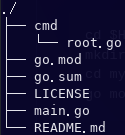
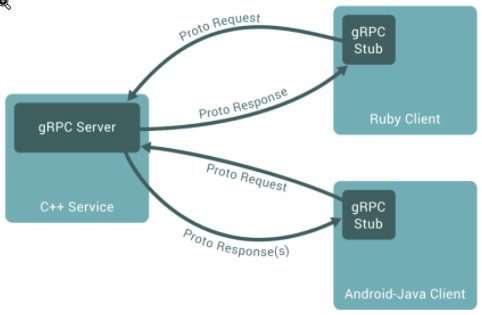

[Awesome gRPC](https://github.com/grpc-ecosystem/awesome-grpc#lang-go)
學習實做方式：[Learning Go by examples: part 6 - Create a gRPC app in Go](https://dev.to/aurelievache/learning-go-by-examples-part-6-create-a-grpc-app-in-go-2ja3)

# 環境
- 先下載 cobra 來用，似乎是一個很好用的 cli 工具[Cobra](https://github.com/spf13/cobra/blob/master/cobra/README.md)
- 以 cobra generator 建立 cli 初始結構
```shell
cobra init
```

- grpc 是有一個 server 跟 client 的兩個 runtime，因此需要建立兩個 cli 來執行

```shell
cobra add client
cobra add server
```
- 要安裝 protoc，以便把 proto script 轉成 binary
```shell
## 使用系統的package meneger
sudo apk add protoc
## 轉 golang 的執行檔
go get -u google.golang.org/protobuf/{proto,protoc-gen-go}
```

# coding
## proto script
- proto script 基本上就是建立程式間的 interface，在範例中，是以建立一個 Gopher service，然後設定 Request 跟 response 的欄位，可以參考 proto 的 [syntax](https://developers.google.com/protocol-buffers/docs/proto3)，並從這個 [table](https://developers.google.com/protocol-buffers/docs/proto3#scalar) 確定在不同程式語言中設定的 type 所代表的變數 type
- 建立 gopher.proto 在 pkg/gopher, 並用 protoc 將它轉出一份 golang 用的lib

```shell
protoc --go_out=plugins=grpc:. \
               --go_opt=paths=source_relative pkg/gopher/gopher.proto

protoc --go_out=plugins=grpc:. \
               --go_opt=paths=source_relative pkg/calculate/calculate.proto
```
- 會產生一個 gopher.pb.go ，之後會導入 server.go
- 如果是相關的 interface ，應該要放在同一個 proto [example](https://github.com/improbable-eng/grpc-web)

## server script
- 需要讀入 pb，設定 server 繼承 UnimplementedGopherServer，並實做 GetGopher
- 在 cmd 裡面，利用 RegisterGopherServer 把 Server 註冊到 grpcServer
- 然後在設定 grpcServer 去聽設定的 port

## client script
- 引入同樣的 pb
- 用 grpc.Dial 跟設定的 port 進行連線
- 用 NewGopherClient 再包出一個 client


# 測試
```shell
## run server
go run main.go server
## run clientGopher to call
go run main.go client gopher wyubin
## run clientCalc to call
go run main.go client calc 2
```

# 心得
- 要把純 grpc 做成比較複雜的多種連線，好像有點麻煩，可能要導入一些 framework
