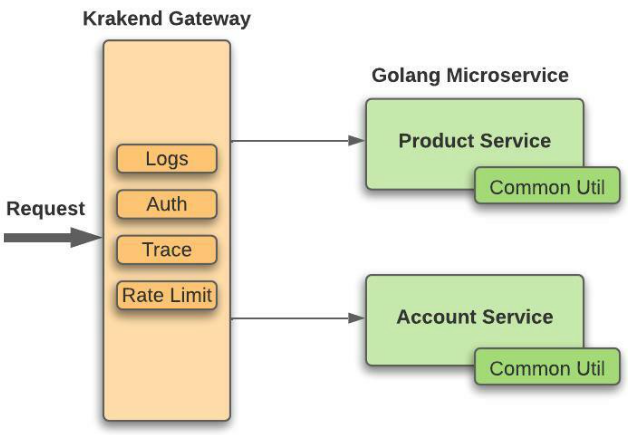

[Writing Beautiful Packages in Go](https://www.youtube.com/watch?v=cmkKxNN7cs4&t=522s)

[golang project structure](https://www.youtube.com/watch?v=l9rMdKO1Vto)

[Golang Microservices — New generation programming language](https://impelsys.medium.com/golang-microservices-new-generation-programming-language-1e07cf84e62f)
  - [product-service](https://github.com/krishnarajvr/microservice-mono-gin-gorm/tree/master/product-service)

[標準 Go 專案目錄結構](https://github.com/golang-standards/project-layout/blob/master/README_zh-TW.md?fbclid=IwAR1jF4wZLutPtuXKuQXD5tcYQsG3I7lAO0ycufaVAk8zoQsf2Pl6ISA1rLk)

[GoLang APIs: A skeleton for your future projects](https://blog.devgenius.io/golang-apis-a-skeleton-for-your-future-projects-a082dc4d6818)

[chatbotgang/go-clean-arch](https://github.com/chatbotgang/go-clean-arch?fbclid=IwAR2jIdhoKBy9ZMBYceaSft2mb0so-s6IfbDUAwuTBXQGMhMnX7Pwl6q-bz8)
