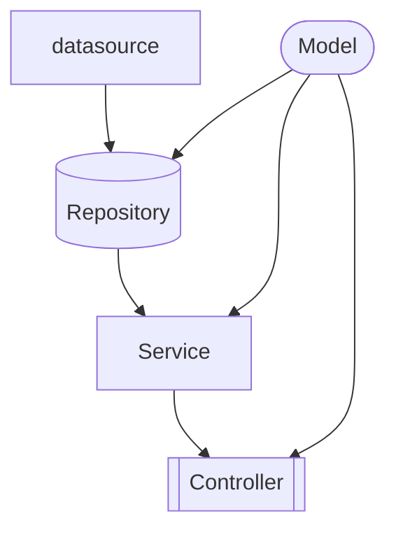

[go-clean-arch](https://github.com/bxcodec/go-clean-arch)

[Trying Clean Architecture on Golang — 2](https://medium.com/hackernoon/trying-clean-architecture-on-golang-2-44d615bf8fdf)

[Standard Package Layout](https://medium.com/@benbjohnson/standard-package-layout-7cdbc8391fc1)

[How To Structure Your Go App](https://www.youtube.com/watch?v=MpFog2kZsHk)

### project structure

- Model 要給其他做ref，因此不應該 import 其他 lib
- 每一個 model 除了定義 model 本身的 struct 以外，還會定義提供給 service 跟 repository 的interface，如此可以統一管理 input and output
- repository 下面再分不同種類的資料來源做wrap ，基於 model 中做出的interface 來實做
- 
