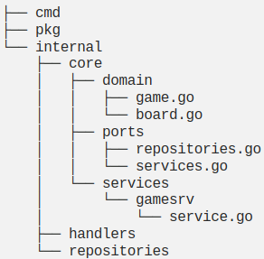

# Ref
[How To Structure Your Go App - Full Course](https://www.youtube.com/watch?v=MpFog2kZsHk)

[Hexagonal Architecture in Go](https://medium.com/@matiasvarela/hexagonal-architecture-in-go-cfd4e436faa3)

[Wild Workouts](https://github.com/ThreeDotsLabs/wild-workouts-go-ddd-example)
# flow
## open project
- 先建立專案相關 dir
```shell
project_dir='hex_arc'
cd $project_dir
# init golang module
go mod init
mkdir -p {cmd,pkg,internal,configs}
```
## role define
- core 是業務邏輯的核心，任何 api 形式進來，如果執行同一個服務，那核心的 script 就必須是相同的
- actors 則是 core 所接觸最外的的那些角色，像是http, cli 等這些 drivers actor 或是像 mysql, redis 這類 driven actors
- ports 則是 core 會使用的 interface，用來執行 core 想達到的業務邏輯，不同 actor 則需要 implement 這些 interface 以實現 core 的行為如何接收或是執行在 driven actor 上，須注意，port 通常會跟core 黏得很緊，很像目前 mcv 中的service 角色
- adapter 則是不同 actor 如何與 core port 銜接的方法，將同類的 actor 會用到的行為單位拆乾淨，再根據不同技術去 implement
- Dependency Injection 則是在/cmd 下面，藉由 configs，連結不同的 driver actor + core + driven actor 形成一個組合的運作

## example
[minesweeper-hex-arch-sample](https://github.com/matiasvarela/minesweeper-hex-arch-sample) - 採地雷邏輯



- core 有 domain 包含 專案的主架構物件，業務邏輯則另外給 service 做，應該不能 dependency 外面的 module
  - 會放在 internal，如果是mono-repo 應該可以放在自己的 project dir
  - ports 則depend domain，規劃外部可用的 interface，把內部的邏輯 expose 到interface 中
  - service 則是實做 ports 的相關interface 提供給外部銜接，像是 gamesrv就是實做 GamesService，實做如何使用ports.GamesRepository 進行repo 的操作 ，算是 core 這邊業務邏輯的部份

- adapter 則放在 handler 的部份，如果是mono-repo 也可以放在pkg 給其他專案使用
  - 像對應 game 這個 domain 的 gamehdl ，則是引用gin來串 http，並用  ports.GamesService 來對應 gamehdl 的 Get, Create 跟 RevealCell 的對應操作
  - gamesrepo 則是直接用記憶體資料結構 單物件 memkvs 來存，實做 GamesRepository 的 Get, 跟 Save 邏輯，提供 core/service 使用

- pkg 那邊則有點像是一般性的 error handle 或是 uuid helper 這類的對應
  - 像是 uidgen 則是建立 UIDGen inferface 來集結像 New 一個 uuid 這樣的功能( script 裡面實做)

- cmd 中的 httpserver 則是在main.go 將 repository, service 跟 handle 先 init instant 並串接好，再經由 gin 的 router 將 endpoint 設計給 handler 並 run 起來

- 可以藉由 gomock 來進行 test 的 mock
