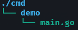

# 目的
搞清楚之後開專案的layout ，也跟模組分離有關
是以 monorepo 的架構去思考

# ref
[Standard Go Project Layout](https://github.com/golang-standards/project-layout/blob/master/README_zh-TW.md?fbclid=IwAR1jF4wZLutPtuXKuQXD5tcYQsG3I7lAO0ycufaVAk8zoQsf2Pl6ISA1rLk)

# 內容
## /cmd
- 主要是最外框指令(cli) 的 runtime，通常只是把執行的指令的 pkg 的參數放在這裡 perform，因此幾乎就是各個專案的指令分開資料夾，裡面通常也只有簡單的 main.go 如下

```golang
package main

import (
	"os"
	"path/filepath"

	"k8s.io/klog"

	"github.com/vmware-tanzu/velero/pkg/cmd"
	"github.com/vmware-tanzu/velero/pkg/cmd/velero"
)

func main() {
	defer klog.Flush()

	baseName := filepath.Base(os.Args[0])

	err := velero.NewCommand(baseName).Execute()
	cmd.CheckError(err)
}
```
連 cobra 跟 viper 都包在 pkg 裡面實做。

## /internal
- 有些 package 在設計時也許就只是針對這個 project 的邏輯去設計，甚至不希望這樣的邏輯套用或使用在其他的project ，就會用 internal 這樣的 path 去限制， go import 時，如果是路徑中有 internal 的，就會去檢查是不是 import 的位置是不是與 internal 的位置同 root，可以參考 Go 1.4 的 [release notes](https://golang.org/doc/go1.4#internalpackages)

## /pkg
- 在這個資料夾中的模組，通常是期待給多個專案共用，因此，如果是跨專案的 pkg 才放這裡，同時也需要維護時要考慮到其他專案的使用方式，如果只有想到在某個專案維護就還是放在各自的專案資料夾會比較好。

## /api
- 主要像是 Swagger 設定 或是 生成的doc 都可以放在這裡，另外如果是專案的邏輯(如果設計方式偏後端)，也可以分資料夾專案，把router controller 跟 service 之類的架構都放在這裡(但tools 就放在tools 就好)

## /web
- monorepo 中偏前端的html 或是 css js 等資料或是template 都放在這邊，如果專案中並沒有這類的 script 就不用設定了

## /configs
- 通常是一些設定example 或是 default setting 等資料放在這個資料夾

## /init
- 在專案中，如果有些是偏 systemctl 那種有服務需要初始畫的，可以將相關檔案放這裡

## /script 
- 則是在專案中總是會有需要做 migration, deploy, release 等相關操作，如果有些是比較複雜的 shell script 等等，可以放在這裡方便 makefile 更簡潔。

## /build
- ci 相關設定或是 dockerfile 等等資料可以放在這裡，可以想成建立系統需要的檔案，像是 drone ci 的 yaml 也是，如果系統有限制設定檔位置，那也可以用 softlink 來做

## /deployments
- 如果部屬也要自己管。則可以放在這樣的資料夾，但現代化的部屬都是把部屬相關設定放在另一個 repo，除非是很簡單不太變更的 repo ，不然不建議自己管 

## /test
- golang 的單元測試通常跟 script 本身放在一起，但如果是整合測試則可以放在/test 這樣的資料夾，也包含一些測試檔跟mock lib

## /docs
- 可以放相關說明文件等等

## /tools
- 跟 script 很像，也許不見得要像這樣另一個 tools

## /example
- lib 的使用範例，但通常會直接放在相關的 makedown 裡面

## /assets
- 如果不是 web 使用的靜態檔，那就放這裡了

## /website
可以把相關的 文件說明放在這裡
